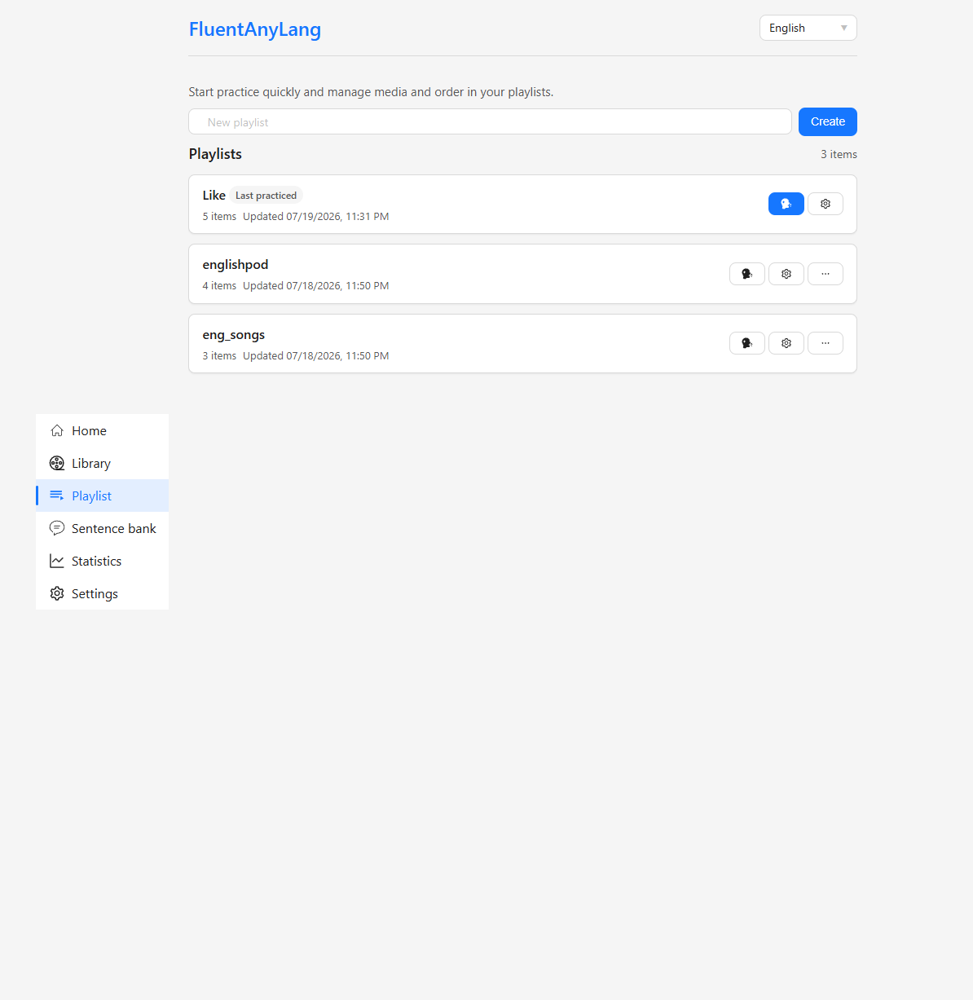
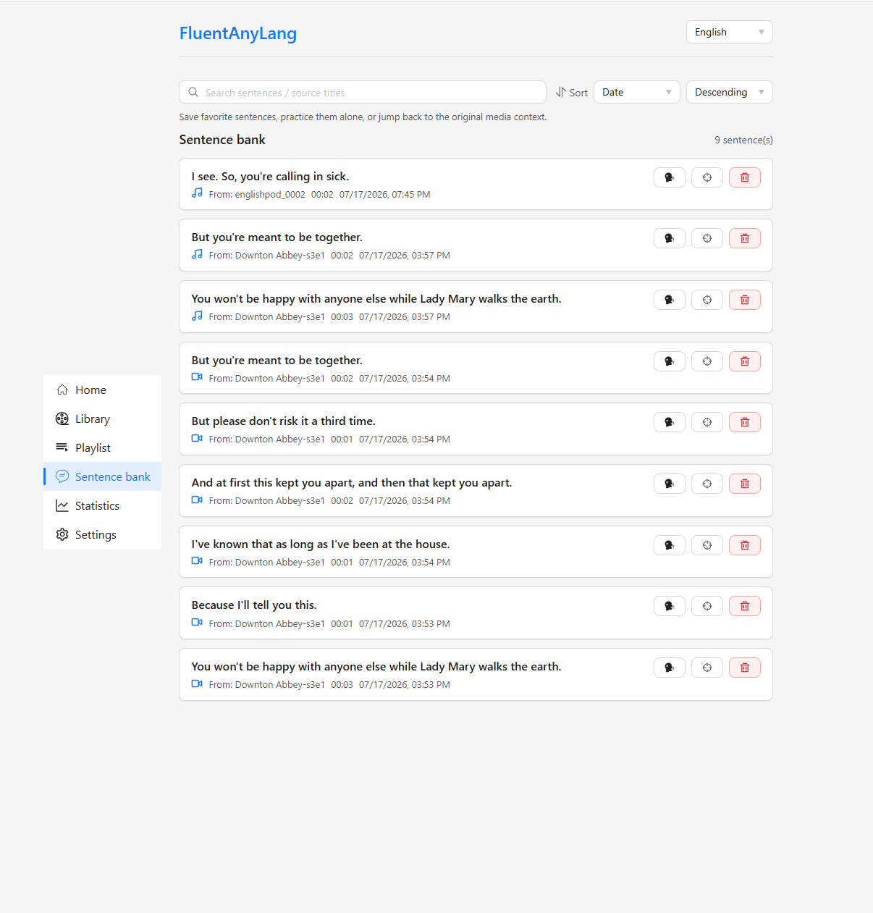
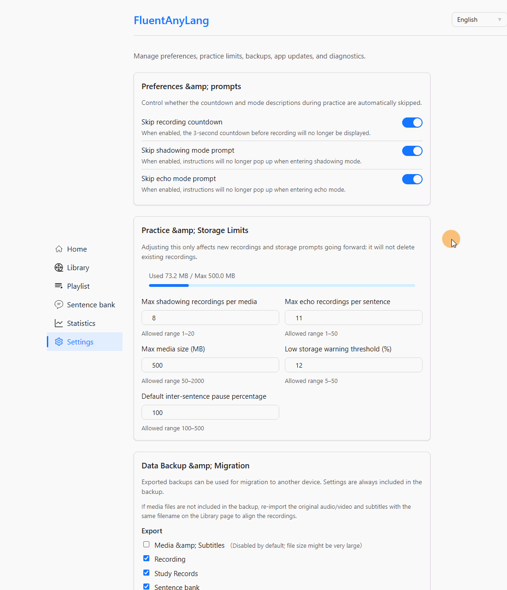
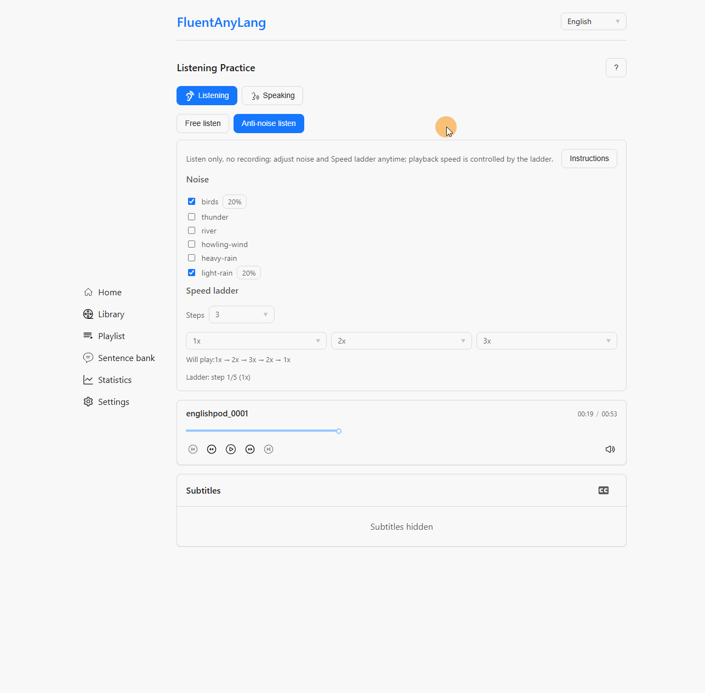
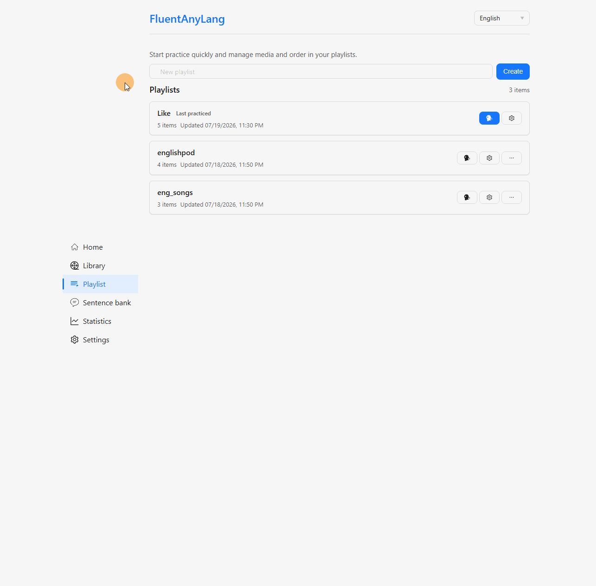
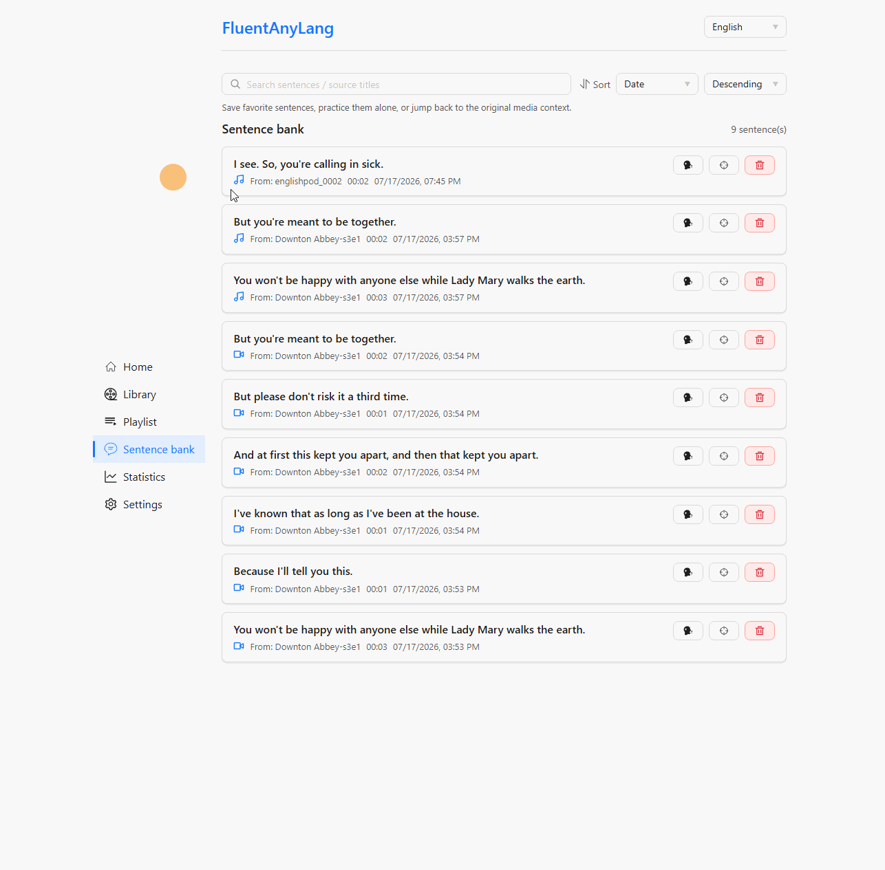

# FluentAnyLang

**English** | [中文](./README.zh-CN.md)

Bring your own audio or video — any language, any material — and practice listening and speaking **sentence by sentence**. Everything stays on your device: no account, no cloud upload.

**[Live Demo](https://fal.jimelijah.com/)** · [GitHub](https://github.com/Jim-Elijah/fluent-any-lang)

## Why FluentAnyLang?

Most language apps lock you into their curriculum. FluentAnyLang is built for **learners who already have the content they care about** — podcasts, dramas, lectures, songs — and want a focused loop of replay, shadowing, and self-review.

- **Your materials, any language** — Import audio/video with `.srt` / `.lrc` subtitles (add later if needed). Bilingual lines are supported.
- **Sentence-driven practice** — Jump, loop, or pause by subtitle line; speaking modes tie every take to the exact sentence.
- **Local-first & private** — Media, recordings, and stats live in IndexedDB. Export a ZIP backup to migrate devices; nothing is uploaded to a server.
- **Installable PWA** — Add to home screen or desktop; app shell works offline after the first visit. Updates are prompted so practice is not interrupted mid-session.

## Features

### Listening

- **Free listen** — Playback speed, volume, prev/next sentence, keyboard shortcuts.
- **Anti-noise listen** — Mix up to 3 ambient noise tracks while listening; optional speed ladder advances after each play-through.
- **Loop & pause** — Loop track or sentence; pause between sentences by fixed seconds or a percentage of line length.
- **Sleep timer** — Stop after N minutes or when the current track ends.
- **Flexible player** — Normal, fixed (floating bar), or mini layout for long sessions.

### Speaking

- **Sync Shadowing** — Record in sync with the original, with countdown cues and a live waveform.
- **Echo** — Hear the line first, then record; keep multiple takes per sentence and pick the best.
- **Compare takes** — Play source only, recording only, or **sync play** (sentence-aligned) with waveform review.

### Library & progress

- **Media, recordings & noise libraries** — Search, sort, filter, custom covers, and export.
- **Playlists & favorites** — Group materials, reorder, and continue the last playlist from the home dashboard.
- **Sentence bank** — Save individual lines (with clipped audio) and drill them later.
- **Practice statistics** — Effective practice time (not wall-clock), streaks, mode mix, trends, and media ranking.

### More

- **UI locales** — Simplified Chinese, English, Japanese, and Traditional Chinese.
- **Backup & migration** — ZIP export/import for recordings, sessions, sentence bank, playlists, settings, and optionally media.

## Screenshots















## How to use

1. Open the [live app](https://fal.jimelijah.com/).
2. Import audio or video (and optional subtitles).
3. Start **Listening** or **Speaking** practice from a media item.
4. Review progress on the statistics page.

No install required for everyday use. Prefer headphones for speaking practice, and grant microphone permission when prompted. You can also install the app as a PWA from the browser menu (“Install” / “Add to Home Screen”).

## Privacy

FluentAnyLang is a client-side app. Practice content and recordings are stored locally in IndexedDB. Clearing site data in the browser removes them — use the built-in ZIP backup if you need to migrate or keep a copy.

## Tech stack

Lit · Vite · TypeScript · IndexedDB (`idb`) · `@lit/localize` · Progressive Web App (service worker)

## Development

Prerequisites: **Node.js 22+** and **pnpm 11+**.

```bash
pnpm install
pnpm dev
```

Useful scripts:

| Command | Description |
| --- | --- |
| `pnpm build` | Localize, typecheck, and production build |
| `pnpm test` | Unit tests |
| `pnpm test:e2e` | Playwright end-to-end tests |
| `pnpm lint` | ESLint |
| `pnpm localize:extract` / `pnpm localize:build` | i18n extract / build |

When hosting the production build as static files, configure SPA fallback so deep links (`/library`, `/practice`, …) rewrite to `index.html`. HTTPS is required for the service worker (and for microphone access).

## License

[MIT](./package.json)
