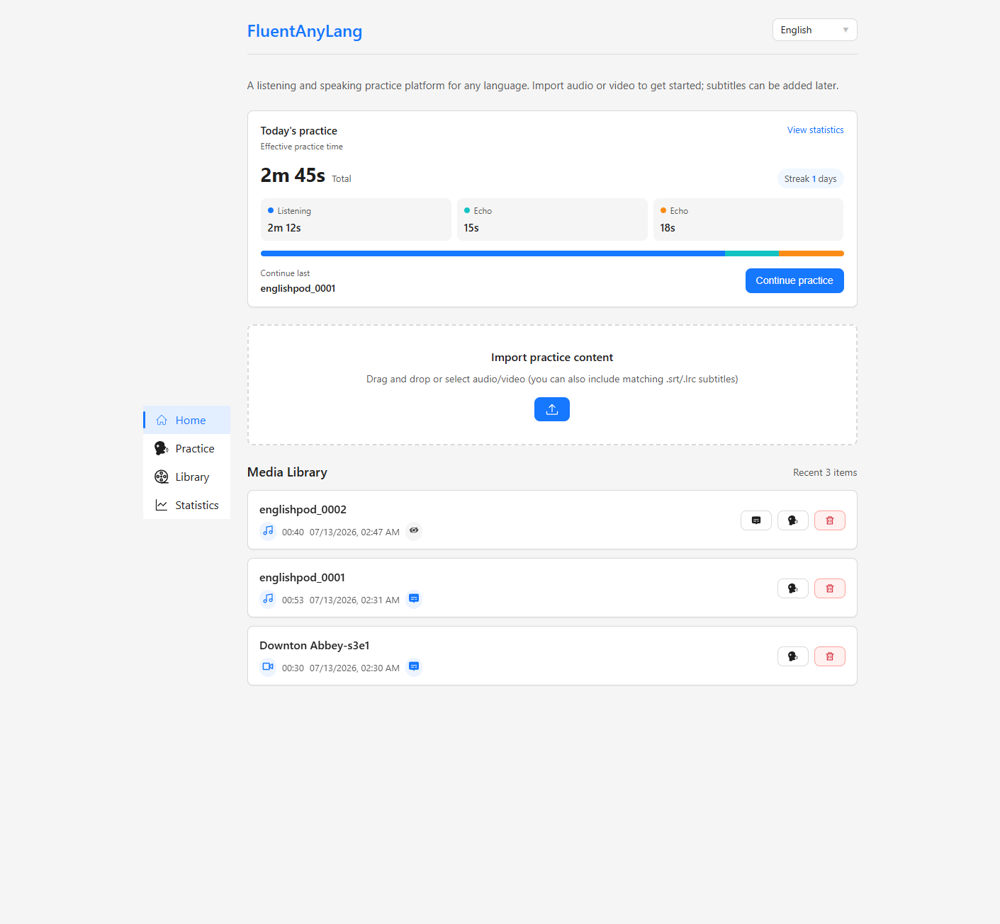
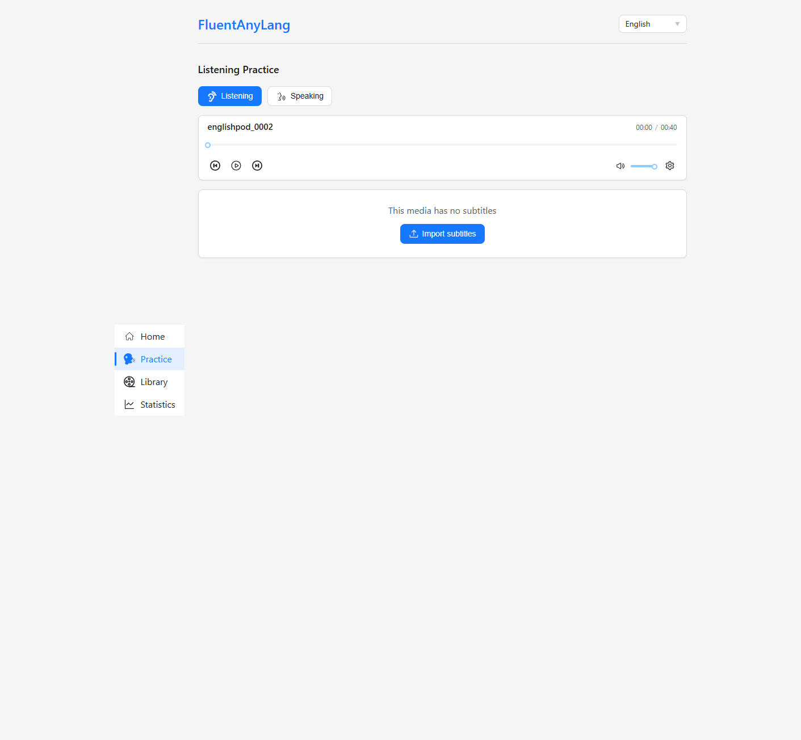
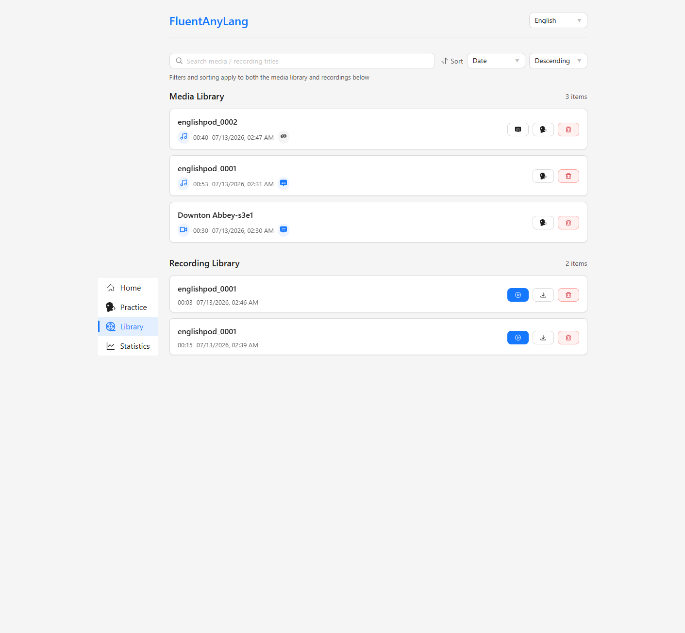
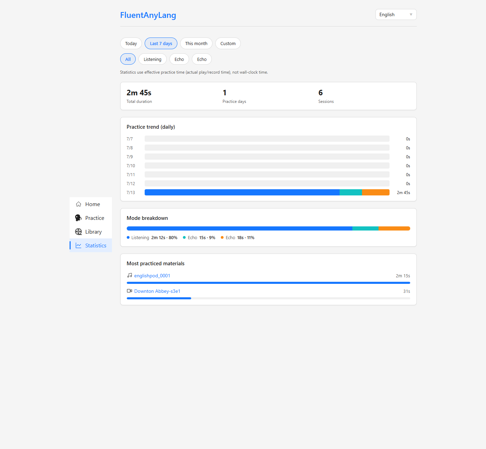
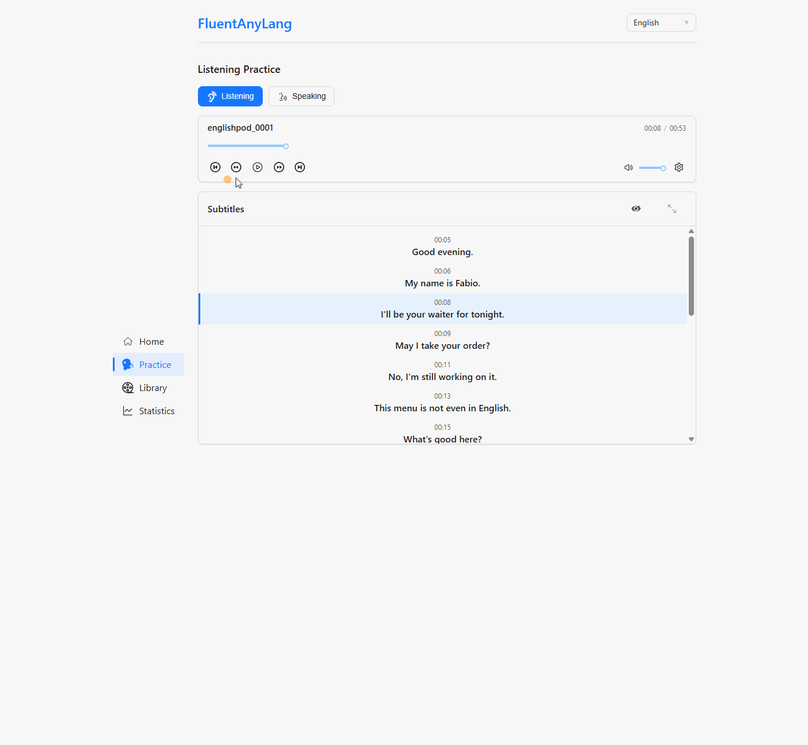
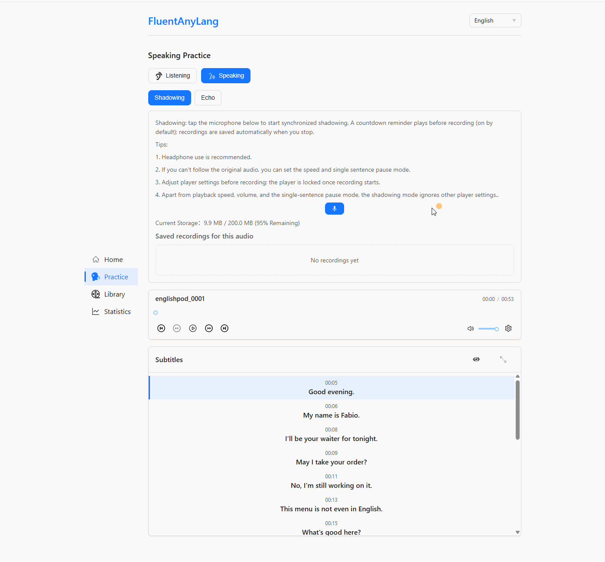
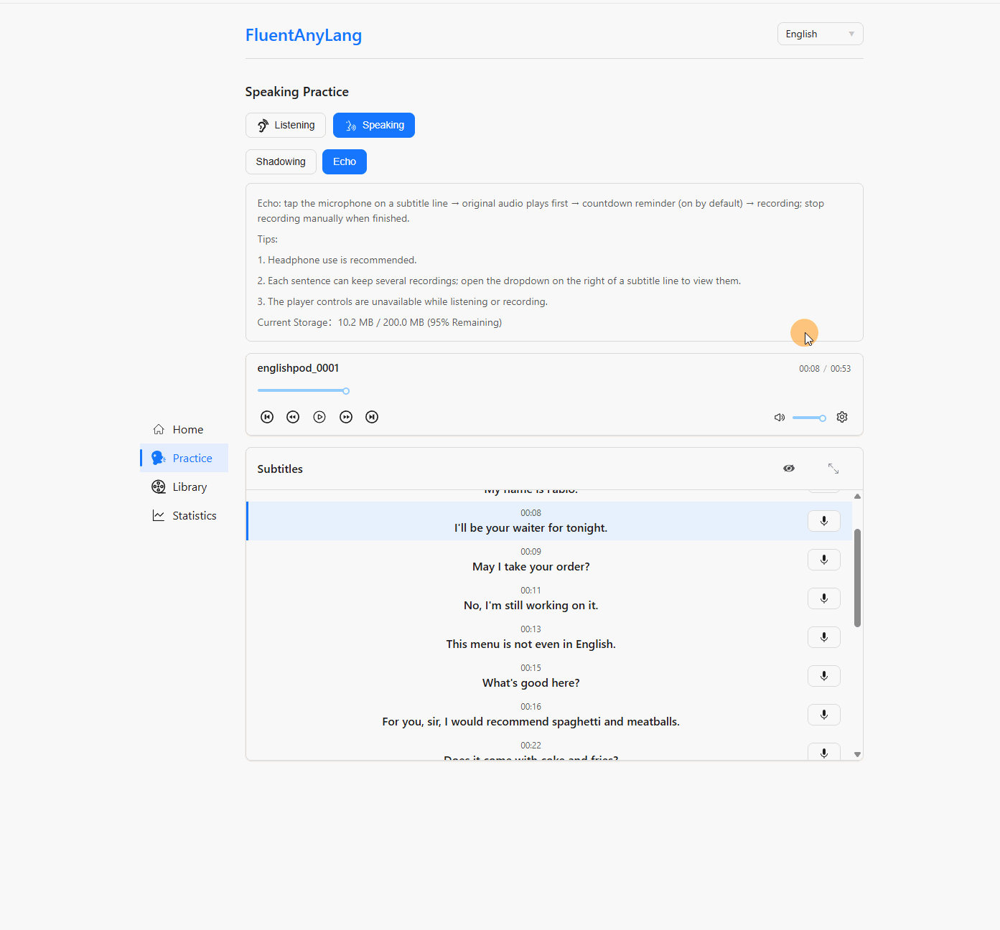

# FluentAnyLang

[English](./README.md) | **中文**

任意语言的听说练习 Web 应用。导入自己的音视频，按句练习，数据保存在本机浏览器中。

**[在线体验](https://fal.jimelijah.com/)** · [GitHub](https://github.com/Jim-Elijah/fluent-any-lang)

## 功能特色

- **任意语言、自有材料** — 导入音视频（可同时带匹配的 `.srt` / `.lrc` 字幕）；字幕也可稍后补充。
- **听力练习** — 变速、循环模式、单句暂停模式、睡眠定时等。
- **口语练习**
  - **跟读（Shadowing）** — 同步跟读并录音，支持倒计时提醒。
  - **单句（Echo）** — 先听原音再录音；每句可保留多条录音。
- **字幕驱动工作流** — 按句跳转，原音与录音对照（含同步播放）。
- **媒体库与录音库** — 搜索、排序、筛选与导出。
- **练习统计** — 有效练习时长、连续天数、模式占比与趋势（非墙上时钟时间）。
- **本地优先、注重隐私** — 媒体、字幕与录音经 IndexedDB 存于浏览器，不会上传到服务器。
- **界面多语言** — 简体中文、英语、日语、繁体中文。

## 截图












## 使用方式

1. 打开[在线应用](https://fal.jimelijah.com/)。
2. 导入音视频（可选字幕）。
3. 从媒体进入 **听力** 或 **口语** 练习。
4. 在统计页查看练习进度。

日常使用无需安装。口语练习建议佩戴耳机，并在提示时授予麦克风权限。

## 隐私说明

FluentAnyLang 为纯前端应用。练习内容与录音保存在本地 IndexedDB。清除网站数据会删除它们；如需备份，请先导出录音。

## 技术栈

Lit · Vite · TypeScript · IndexedDB（`idb`）· `@lit/localize`

## 本地开发

环境要求：**Node.js 22+**、**pnpm 11+**。

```bash
pnpm install
pnpm dev
```

常用脚本：

| 命令 | 说明 |
| --- | --- |
| `pnpm build` | 本地化构建、类型检查与生产构建 |
| `pnpm test` | 单元测试 |
| `pnpm test:e2e` | Playwright 端到端测试 |
| `pnpm lint` | ESLint |
| `pnpm localize:extract` / `pnpm localize:build` | 提取 / 构建文案 |

## 许可证

[MIT](./package.json)
