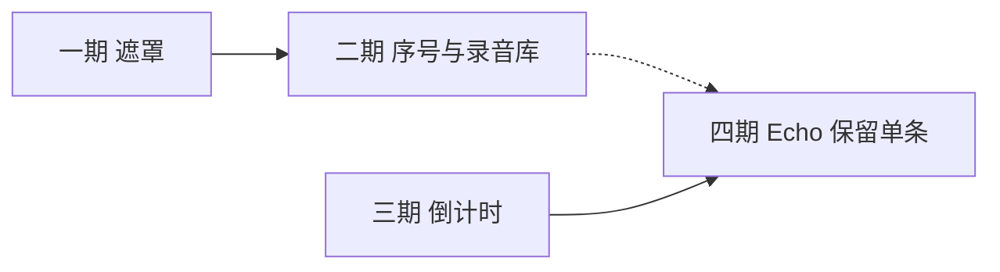

# 用户反馈分期落地计划

依据 `[docs/faq.md](../faq.md)` 与 `[CONTEXT.md](../../CONTEXT.md)` 中的产品边界整理。面向「按句练习、本地数据、Echo / Shadowing 分工明确」的自导入练听练说场景。

## 产品定位（摘要）

- 学习者导入自有 **Media**，按 **Subtitle Segment** 练听（自由听、抗噪听）与练说（影子跟读、回声跟读）。
- **Echo**：先听句再录，可与 Shadowing 区分；**不**通过「跳过听原句」模糊两种口语模式（FAQ 已明确短期不做）。
- 练习页以句级列表与行内操作为中心；`C` 整段隐藏字幕区与「遮罩原文、保留操作」是不同需求。

## 基线（本计划不重复建设）

| 诉求            | 状态                               |
| ------------- | -------------------------------- |
| 录音批量删除 / 导出   | **已支持**：库 → 录音 →「管理」             |
| 回声跳过听原句、直接开录  | **明确不做**（短期）；替代：Shadowing、句库自控播放 |
| 隐藏译文          | **已支持**：`T`                      |
| 隐藏整段字幕列表      | **已支持**：`C`（含行内按钮）               |
| 关闭 / 自定义录音前倒计时 | **已支持**：跳过开关 + **3–10 秒**（默认 3；Echo / Shadowing 共用；与「跳过听原句」无关） |

---

## 一期：字幕遮罩模式

**状态：已落地（2025-09-25）**

**已决（2026-09-29 起）：** 三档循环，同一套模糊（`blur` + 略降透明度），无临时揭遮。**`M`** 与字幕区同一个按钮：不遮罩 → 只显示当前句 → 全部遮罩原文 → 不遮罩。按钮文案是下一档。没有当前句（`currentSegmentIndex` 为 -1）时，「只显示当前句」和「全部遮罩原文」都会模糊全部原文；句间空隙仍高亮上一句，只显示当前句会保留那一句。译文仍由 `T` 控制。Echo 评分角标仍显示。全屏与普通列表共用同一渲染。

**设置 → 偏好与提示** 的「遮罩原文」是下次进入练习的默认（`sourceMaskMode`: `off` / `current` / `all`，默认 `off`）。练习中的循环不写回设置。

| `C` 字幕列表 | 遮罩档位 | 效果 |
| --- | --- | --- |
| 关 | 任意 | 「字幕已隐藏」（档位保留，再开 `C` 恢复；隐藏时 `M` 不推进档位） |
| 开 | 不遮罩 | 全部原文可见 |
| 开 | 只显示当前句 | 当前句原文清晰，其余模糊；无当前句时全部模糊 |
| 开 | 全部遮罩原文 | 每一句原文都模糊 |

**实现摘要**

- `subtitle-panel`：会话级 `_sourceMaskMode`（进入时读 `sourceMaskMode`）；`current` 模糊非当前句，`all` 模糊全部原文；无当前句时 `current` 也全部模糊。Echo 评分角标与译文（`T`）不受影响。
- 练习页 **`M`**（`toggleSubtitleSourceMask`）与字幕区工具栏循环三档，不调用 `setAppSettings`。快捷键帮助 catalog 文案为「切换遮罩原文」。无 Subtitle Track 时不展示入口。

**文档：** [`docs/faq.md`](../faq.md) 已更新说明与 `C` / `T` 分工。

**验收（已通过）**

- 遮罩开启：行内跟读 / Echo / 句库可用；`C` 隐藏后遮罩状态保留；全屏与普通列表一致。
- `subtitle-panel.test.ts`、`hotkeys/catalog.test.ts` 覆盖主路径。

---

## 二期：字幕序号与录音库句信息

**状态：已落地（2025-09-25）**

**已决：** 1-based、轨内数组顺序（与跳转句一致）；摘要优先快照并复用 `resolveReferenceText` 降级；截断 80 字；格式 `#n` / `#n–m`（单句不显示区间）；Shadowing 跨多句显示区间；Echo 单句序号。

**目标：** 降低「这是第几句 / 哪一句的录音」的认知成本；不改变按句练习核心流程。

**交付（建议）**

- 字幕列表：在现有时间戳旁（或替代部分占位）展示 **句序号**（与 Subtitle Segment 在轨内顺序一致）。
- 库 → 录音列表：展示 **句序号**（有则显示）与 **原文摘要**（来自 Practice Record 句子快照；旧数据无快照时的降级策略见商定项）。

**需商定的产品决策**

1. **序号规则**
  - 1-based、按 Subtitle Track 内 `start` 时间排序是否与用户心智一致；导入 SRT 后若编辑/合并句，序号是否随存储顺序重算。
2. **录音库字段**
  - 仅新录音 vs 尽力回填（无快照则显示「—」或 Media 名 + 时间）；摘要最大字符数与截断规则（按字 / 按词）。
3. **序号与遮罩 / 隐藏**
  - 一期若采用「非当前句仅显示序号 + 时间戳」，二期序号样式是否成为遮罩模式的依赖——若一期未选 C 方案，二期是否仍单独上序号。

**需商定的 UI / 文案**

- 序号格式：`#12`、`12.`、或与时间戳同一行 / 独立列（窄屏换行规则）。
- 录音列表列顺序：Media 标题、序号、摘要、时长、日期等的优先级。
- 摘要为空时的占位文案（避免空白行）。

**验收要点**

- 有序字幕的 Media：列表序号连续、与点击跳转句一致。
- 录音列表：有新快照的条目可一眼对应句子；无快照条目降级不报错。

---

## 三期：跟读倒计时秒数可配置

**状态：已落地（2025-09-25）**

**已决：** Echo + Shadowing 共用；保留「跳过录音倒计时」开关；未跳过时 **3–10 秒**（默认 3）；设置页下拉选择，跳过时控件禁用。

**目标：** 在保留「可关闭倒计时」的前提下，允许自定义 Echo（及是否 Shadowing）录音前等待秒数；仍为固定秒数，非「跳过听原句」。

**实现摘要**

- `AppSettings.recordingCountdownSeconds`（3–10，默认 3）；`skipRecordingCountdown` 布尔保留，分层生效。
- 设置 → 偏好与提示：跳过开关 + 秒数下拉（跳过时禁用）；`getRecordingCountdownSeconds()` 供 `audio-recorder` / `runRecordingCountdown` 读取。
- 旧用户无新字段时解析回落默认 3；`skipRecordingCountdown: true` 无需迁移。

**文档：** [`docs/faq.md`](../faq.md) 已更新倒计时说明与「跳过听原句」区分。

**验收（已通过）**

- 改秒数或跳过开关后，新开始的录音轮次生效；跳过时不阻塞录音流程。
- Echo 仍须先听完该句再录（不支持跳过听句）；倒计时 overlay 仍可按现有交互「以后跳过」写入开关。
- `app-settings.test.ts`、`settings-preferences.test.ts`、`audio-recorder.test.ts` 覆盖主路径。

---

## 四期：Echo 多 take 整理（保留单条）

**目标：** 减轻「同一句多条 Practice Record 手动逐条删」的操作负担；**不**承诺自动「最好一条」（除非商定接入 Pronunciation Score）。

**交付（建议）**

- 句旁「管理录音」：增加 **「仅保留本条」**（或等价文案），删除同句其余 Practice Record（需确认对话框，见商定项）。
- 可选增强（若产品同意纳入本期或拆子里程碑）：**标星 / 设为主 take**，列表默认展开主 take；不含自动按分数删其余。

**需商定的产品决策**

1. **「最好一条」边界**
  - 仅手动「保留本条」 vs 将来用 Pronunciation Score 推荐保留（若后者，是否列为 **计划外** 独立项目并引用 `[docs/pronunciation-score-api.md](../pronunciation-score-api.md)`）。
2. **删除范围**
  - 仅当前 Subtitle Segment + 当前 Media，还是含句库关联录音；删除是否连带 blob 与可选 Score 行。
3. **Shadowing 多段录音**
  - Echo 多条是主场景；Shadowing 是否同样暴露「仅保留本条」。

**需商定的 UI / 文案**

- destructive 操作确认文案（条数预览、不可恢复提示）。
- 保留后 UI：是否自动切到保留条目的对比播放 / 预览。

**验收要点**

- 多 take 场景下保留一条后，列表与 DB 一致；误触可理解、有确认。
- 与库 → 录音批量删除行为不冲突。

---

## 分期依赖关系

- **一期 → 二期（弱依赖）：** 遮罩保留行与时间戳（模糊原文），不依赖句序号；二期可独立上线。
- **三期与四期：** 无硬依赖，可并行；四期与发音评分无硬依赖 unless 产品决定「智能保留最好」。

## 文档与验证

- 行为或 invariant 变更时：同步 `[docs/faq.md](../faq.md)`；若遮罩/倒计时触及练习状态机，核对 `[docs/critical-paths.md](../critical-paths.md)` 中 Change → verify 行并补测试。
- 各期上线前：快捷键 catalog、设置页说明、（若有）E2E 覆盖主路径即可，避免为次要组合 explosion。

## 修订记录

| 日期         | 说明                 |
| ---------- | ------------------ |
| 2025-09-25 | 初稿：FAQ 反馈四期拆分与待商定项 |
| 2025-09-25 | 一期落地：遮罩原文（M、语义 B、模糊） |
| 2026-09-29 | 遮罩原文改为三档：设置默认 + 练习内 M 循环，不写回设置 |
| 2025-09-25 | 二期落地：字幕 # 序号、录音库序号区间与摘要 |
| 2025-09-25 | 三期落地：录音前倒计时 3–10 秒 + 保留跳过开关 |

